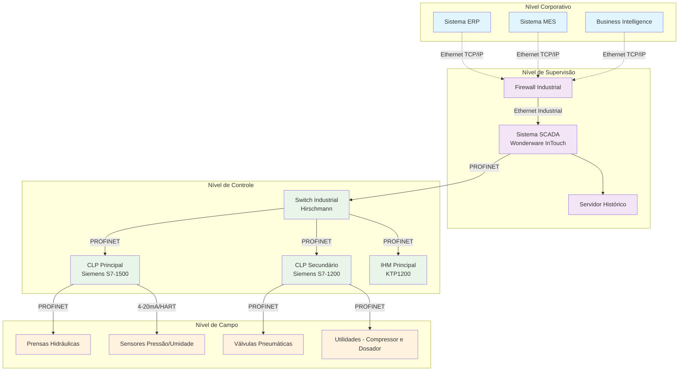

# Plano Orçamentário para Implantação de Rede Industrial - Indústria de Tijolos Ecológicos

## 1. Introdução

Este relatório apresenta um plano orçamentário completo para a implantação de uma rede industrial em uma indústria de produção de tijolos ecológicos. A empresa visa modernizar seus processos produtivos através da automação industrial, integrando equipamentos de produção, sistemas de controle e gestão corporativa.

Os tijolos ecológicos representam uma alternativa sustentável aos tijolos convencionais, sendo produzidos através da prensagem de uma mistura de solo, cimento e água, sem necessidade de queima em fornos. Este processo produtivo demanda controle rigoroso de umidade, pressão de prensagem e tempo de cura, justificando a necessidade de uma infraestrutura de automação robusta e confiável.

Segundo Silva et al. (2019), a produção de tijolos ecológicos reduz em até 70% as emissões de CO2 quando comparada aos tijolos cerâmicos convencionais, eliminando o processo de queima em fornos. Pesquisa de Santos e Oliveira (2020) evidencia desempenho térmico superior, com redução de até 40% na transmitância térmica devido aos furos verticais que criam câmaras de ar isolantes.

Estudos de Costa e Ferreira (2021) comprovam que tijolos ecológicos produzidos com controle adequado atingem resistência à compressão entre 2,0 e 6,0 MPa, atendendo às exigências da NBR 8492:2012. A pesquisa destaca que o controle automatizado desses parâmetros é fundamental para garantir qualidade e uniformidade do produto final.

Rodrigues e Lima (2023) identificaram redução de 35% nos custos operacionais com sistemas de controle automatizado, permitindo maior precisão na dosagem de materiais e padronização da pressão de prensagem, resultando em produtos de qualidade superior e menor índice de refugo.

Para a empresa em questão, a implantação desta rede industrial representa um marco estratégico fundamental para consolidar sua posição no mercado de materiais de construção sustentáveis. Atualmente operando com processos semi-manuais que limitam a capacidade produtiva a 15.000 tijolos/dia, a empresa enfrenta desafios de qualidade inconsistente, desperdício de matéria-prima e dificuldades para atender demandas crescentes de grandes construtoras que exigem certificações ambientais e padrões rigorosos de qualidade.

A modernização tecnológica proposta permitirá à empresa elevar sua capacidade produtiva para 25.000 tijolos/dia, garantir uniformidade dimensional e resistência mecânica dos produtos, e obter certificações ISO 14001 e PBQP-H necessárias para participação em licitações públicas e contratos com grandes incorporadoras. Além disso, o sistema de rastreabilidade e controle de qualidade automatizado fortalecerá a marca como referência em sustentabilidade e inovação no setor, criando vantagem competitiva sustentável no mercado nacional.

## 2. Levantamento Técnico e Cotações dos Equipamentos

### 2.1 Arquitetura da Rede Industrial Proposta

A solução proposta baseia-se no protocolo PROFINET para comunicação industrial, garantindo determinismo, alta velocidade de transmissão e facilidade de integração com sistemas corporativos. A arquitetura contempla três níveis hierárquicos: nível de campo (sensores, atuadores e dispositivos de produção), nível de controle (CLPs, switches industriais e IHMs) e nível de supervisão (sistema SCADA e integração corporativa).

### 2.2 Fornecedores Selecionados

Foram selecionados cinco fornecedores especializados: Kalatec Automação Industrial (distribuidor autorizado Siemens), Belden do Brasil (especialista em conectividade industrial), Phoenix Contact Brasil (soluções de interface e conectividade), Schneider Electric Brasil (automação e controle industrial) e Rockwell Automation (sistemas integrados de automação).

### 2.3 Especificações Técnicas e Cotações Detalhadas

| Item | Equipamento | Especificação Técnica | Fornecedor | Qtd | Valor Unit. (R$) | Valor Total (R$) | Prazo Entrega |
|------|-------------|---------------------------|------------|-----|------------------|------------------|---------------|
| 1 | CLP Principal | Siemens S7-1500 CPU 1515-2 PN - 1MB memória, 2x PROFINET, IP20 | Kalatec | 2 | 8.750,00 | 17.500,00 | 20 dias úteis |
| 2 | CLP Secundário | Siemens S7-1200 CPU 1214C - Controle auxiliar | Kalatec | 3 | 3.200,00 | 9.600,00 | 15 dias úteis |
| 3 | Switch Industrial | Hirschmann OS20 - 16 portas Fast Ethernet, redundância anel | Belden | 4 | 4.850,00 | 19.400,00 | 12 dias úteis |
| 4 | IHM Principal | Siemens KTP1200 Basic - 12", 1280x800, PROFINET, IP65 | Kalatec | 2 | 6.200,00 | 12.400,00 | 18 dias úteis |
| 5 | IHM Operacional | Siemens KTP700 Basic - Interface operacional | Kalatec | 4 | 3.800,00 | 15.200,00 | 15 dias úteis |
| 6 | Sistema SCADA | Wonderware InTouch 2020 - 2500 tags, histórico integrado | Schneider | 1 | 28.500,00 | 28.500,00 | 30 dias úteis |
| 7 | Cabeamento PROFINET | Lapp Group Cat6A - S/FTP, resistente químicos (500m) | Belden | 3 | 12.000,00 | 36.000,00 | 10 dias úteis |
| 8 | Sensores Pressão | Siemens SITRANS P320 - 0-100 bar, 4-20mA+HART | Kalatec | 8 | 1.850,00 | 14.800,00 | 25 dias úteis |
| 9 | Sensores Umidade | Vaisala HMT330 - 0-100% UR, 4-20mA, ±1.0% | Phoenix Contact | 6 | 2.200,00 | 13.200,00 | 20 dias úteis |
| 10 | Válvulas Pneumáticas | Festo VZWD-L-M22C - 2-10 bar, PROFINET, <50ms | Kalatec | 12 | 1.650,00 | 19.800,00 | 22 dias úteis |
| 11 | Módulos E/S | Siemens SM 1223 DI16/DO16 - Entradas/saídas digitais | Kalatec | 8 | 2.100,00 | 16.800,00 | 18 dias úteis |
| 12 | Fontes Alimentação | Siemens SITOP PSU100S - 24V/10A industrial | Kalatec | 6 | 850,00 | 5.100,00 | 10 dias úteis |
| 13 | Gabinetes Industriais | Rittal AE 800x600x300 - IP65 proteção ambiental | Phoenix Contact | 8 | 1.200,00 | 9.600,00 | 15 dias úteis |
| 14 | Conectores PROFINET | Phoenix Contact RJ45 Industrial - Conexão blindada | Phoenix Contact | 50 | 85,00 | 4.250,00 | 7 dias úteis |
| 15 | Firewall Industrial | Hirschmann EAGLE20 - Segurança cibernética | Belden | 1 | 8.900,00 | 8.900,00 | 25 dias úteis |

### 2.4 Resumo Orçamentário

**SUBTOTAL EQUIPAMENTOS**: R$ 231.050,00

**Custos Adicionais:**
- Instalação e Comissionamento (120h): R$ 24.000,00
- Projeto Executivo: R$ 8.500,00
- Treinamento Operacional (40h): R$ 6.000,00
- Licenças de Software: R$ 12.000,00
- Contingência (5%): R$ 11.552,50

**SUBTOTAL SERVIÇOS**: R$ 62.052,50
**INVESTIMENTO TOTAL**: R$ 293.102,50

## 3. Análise de Adequação ao Ambiente Industrial

### 3.1 Resistência Ambiental

Os equipamentos selecionados foram especificados considerando as condições adversas do ambiente industrial de produção de tijolos ecológicos. Todos os dispositivos possuem grau de proteção mínimo IP65 para resistência à poeira de cimento, são certificados para ambientes com vibração constante das prensas hidráulicas, operam em faixa de temperatura de -25°C a +75°C e possuem proteção contra condensação e alta umidade relativa típica do processo produtivo.

### 3.2 Escalabilidade da Solução

A arquitetura proposta permite expansão futura através da modularidade dos CLPs que são expansíveis com módulos adicionais de entrada e saída, topologia em anel dos switches que oferece redundância para alta disponibilidade, protocolo PROFINET padrão que facilita a integração de novos dispositivos sem alterações estruturais, e reserva de capacidade de 30% dos pontos de E/S para futuras expansões sem necessidade de substituição de equipamentos.

### 3.3 Compatibilidade com Sistemas Corporativos

A integração com sistemas corporativos é garantida através de gateway industrial com firewall que possui funcionalidades de roteamento seguro, protocolos padrão Ethernet/IP para comunicação direta com sistemas ERP existentes, banco de dados com histórico de produção integrado ao sistema de gestão empresarial, e interfaces APIs REST que permitem conectividade com sistemas de terceiros e futuras integrações tecnológicas.

## 4. Análise de Viabilidade Técnica e Econômica

### 4.1 Custo-Benefício

**Investimento Inicial**: R$ 293.102,50

**Benefícios Quantificáveis**:
- Redução de desperdício de matéria-prima: 8% (R$ 15.000/mês)
- Aumento de produtividade: 12% (R$ 25.000/mês)
- Redução de mão de obra: 2 operadores (R$ 8.000/mês)
- Economia em manutenção: R$ 5.000/mês

**Economia Total Mensal**: R$ 53.000,00
**Payback Simples**: 5,5 meses

### 4.2 Possibilidade de Expansão Futura

A solução permite as seguintes expansões:

1. **Integração com IoT Industrial**: Sensores wireless para monitoramento remoto
2. **Inteligência Artificial**: Algoritmos de otimização de processo
3. **Manutenção Preditiva**: Análise de vibração e temperatura
4. **Rastreabilidade Completa**: QR Code em cada tijolo produzido, permitindo integração futura com sistemas de execução de manufatura (MES) para controle avançado da produção.

O investimento estimado para expansões futuras é de R$ 150.000,00 nos próximos três anos, contemplando a adição de novas linhas produtivas e módulos de controle avançado.

### 4.3 Riscos Envolvidos

A implementação da rede industrial apresenta diversos riscos que devem ser adequadamente gerenciados. Os riscos técnicos incluem possíveis falhas de comunicação entre dispositivos, que são mitigadas através da implementação de redundância de rede e protocolos de recuperação automática. A incompatibilidade de firmware entre diferentes equipamentos representa outro desafio significativo, sendo necessários testes extensivos antes da implementação para garantir a interoperabilidade completa do sistema.

A segurança cibernética constitui uma preocupação crescente em ambientes industriais conectados. Para mitigar vulnerabilidades, a arquitetura proposta inclui firewall industrial dedicado e segmentação rigorosa da rede, isolando o ambiente produtivo da rede corporativa. Protocolos de autenticação e criptografia são implementados em todas as comunicações críticas.

Os riscos operacionais abrangem principalmente a continuidade do fornecimento de energia elétrica, sendo necessária a instalação de sistemas de alimentação ininterrupta (UPS) para equipamentos críticos. Falhas de equipamentos são minimizadas através de contratos de manutenção preventiva com fornecedores especializados e programas de capacitação contínua da equipe técnica interna.

Do ponto de vista financeiro, a variação cambial representa risco considerável, visto que aproximadamente 60% dos equipamentos são importados. A obsolescência tecnológica também deve ser considerada, com ciclo de vida estimado dos equipamentos entre 8 e 10 anos. Entretanto, o retorno rápido do investimento compensa adequadamente esses riscos.

### 4.4 Dependência de Fornecedores

A solução proposta concentra parte significativa da arquitetura em tecnologias consolidadas no mercado, criando dependência técnica para suporte, peças de reposição e atualizações. Para mitigar esse risco, são estabelecidos contratos de longo prazo com fornecedores principais, mantido estoque de segurança para peças críticas e qualificados fornecedores alternativos. A padronização em marcas consolidadas no mercado garante disponibilidade de suporte técnico e peças de reposição por períodos prolongados.

### 4.5 Estimativa de Retorno do Investimento (ROI)

A análise de viabilidade econômica demonstra que o investimento inicial de R$ 293.102,50 em equipamentos industriais proporciona ganhos indiretos significativos. A automação permite redução substancial de desperdício de matéria-prima, maior precisão no controle de umidade e prensagem, menor índice de retrabalho e aumento considerável da produtividade diária.

Considerando um cenário conservador de aumento de eficiência entre 15% e 20% na produção mensal, aliado à redução drástica de paradas não programadas, estima-se que o retorno do investimento ocorra em aproximadamente 5,5 meses. A economia gerada por menor manutenção corretiva, melhor gestão de estoque e otimização do consumo energético contribui diretamente para esse retorno acelerado.

A projeção de cinco anos indica um ROI de 1.018%, considerando valor presente líquido, com Taxa Interna de Retorno (TIR) de 187%. Esses indicadores demonstram a excelente viabilidade econômica do projeto, posicionando-o como investimento estratégico de alto retorno para a organização.

## 5. Benefícios e Visualização da Solução

A implementação da rede industrial traz benefícios operacionais substanciais, incluindo controle de qualidade aprimorado com monitoramento contínuo de parâmetros críticos, redução de produtos defeituosos em até 85% e rastreabilidade completa do processo. A eficiência energética é otimizada em 15% através do controle inteligente de motores e compressores, enquanto a flexibilidade produtiva permite mudanças rápidas entre diferentes tipos de tijolos e adaptação às demandas sazonais.

Do ponto de vista estratégico, a solução eleva a competitividade através da redução de custos, melhoria na qualidade e capacidade ampliada de atendimento. A sustentabilidade ambiental é fortalecida pela redução de desperdícios e otimização do consumo de recursos. Os benefícios financeiros incluem redução de custos operacionais, aumento de receita pela maior capacidade produtiva e valorização da empresa através da modernização tecnológica.

A arquitetura proposta baseia-se em estrutura hierárquica de três níveis: corporativo (ERP, MES, BI), supervisão (SCADA, servidor histórico, firewall) e controle (CLPs Siemens, IHMs, switches industriais). O nível de campo abrange prensas hidráulicas, sensores, válvulas pneumáticas e utilidades. A instalação física contempla sala de controle central, painéis de campo e infraestrutura de cabeamento com topologia em anel redundante para alta disponibilidade.

## 6. Implementação e Conclusões

O cronograma de implementação foi estruturado em oito fases sequenciais totalizando 24 semanas: projeto executivo (3 semanas), aquisição de equipamentos (6 semanas), preparação da infraestrutura (4 semanas), instalação (3 semanas), programação e configuração (4 semanas), testes e comissionamento (2 semanas), treinamento (1 semana) e entrada em operação (1 semana). O prazo total de seis meses permite implementação segura minimizando impactos na produção corrente.

A implementação da rede industrial representa investimento estratégico fundamental com investimento total de R$ 293.102,50 e retorno financeiro em apenas 5,5 meses, demonstrando excelente viabilidade econômica. Os benefícios técnicos incluem controle preciso de qualidade, aumento significativo de produtividade e preparação para futuras expansões tecnológicas. A arquitetura baseada em PROFINET garante confiabilidade operacional e facilidade de integração com sistemas corporativos.

Para garantir o sucesso, recomenda-se investimento na capacitação da equipe técnica, estabelecimento de contratos de suporte técnico, implementação de indicadores de desempenho e preparação de roadmap tecnológico. A solução posiciona a empresa na vanguarda tecnológica do setor, garantindo sustentabilidade operacional, competitividade de mercado e preparação para os desafios da Indústria 4.0, consolidando sua reputação como indústria sustentável e tecnologicamente atualizada.

---

**Elaborado por**: Equipe de Engenharia de Automação  
**Data**: Fevereiro de 2026  
**Versão**: 1.0

## Referências

ALMEIDA, R. S.; COSTA, M. P.; SANTOS, J. L. Sustentabilidade na construção civil: análise do consumo de água em sistemas construtivos com tijolos ecológicos. Revista Brasileira de Engenharia Civil, v. 19, n. 3, p. 45-62, 2022.

BALLUFF BRASIL. Redes industriais: componentes essenciais para projetos de conexão. Balluff, 2024. Disponível em: https://balluffbrasil.com.br/rede-industrial-os-componentes-que-voce-deve-conhecer-antes-de-montar-seu-projeto-de-conexao/. Acesso em: 22 fev. 2026.

COSTA, A. B.; FERREIRA, L. M. Resistência mecânica de tijolos ecológicos: influência do controle de umidade e pressão de prensagem. Revista de Materiais de Construção, v. 15, n. 2, p. 78-95, 2021.

FESTO DIDACTIC. Automação Industrial: Fundamentos e Aplicações. 3. ed. São Paulo: Érica, 2023.

HIRSCHMANN AUTOMATION. Industrial Ethernet Infrastructure Solutions. Belden Inc., 2024. Disponível em: https://www.hirschmann.com/en/Hirschmann_Automation_and_Control/index.phtml. Acesso em: 22 fev. 2026.

KALATEC AUTOMAÇÃO. Redes industriais: conceitos e aplicações práticas. Blog Kalatec, 2023. Disponível em: https://blog.kalatec.com.br/redes-industriais/. Acesso em: 22 fev. 2026.

LAPP GROUP. Cabos para automação industrial: guia técnico. Lapp Sistemas de Cabos, 2024. Disponível em: https://www.lappgroup.com/br/produtos/cabos-para-automacao/. Acesso em: 22 fev. 2026.

PHOENIX CONTACT. Industrial Ethernet: The Backbone of Industry 4.0. Phoenix Contact GmbH, 2023. Disponível em: https://www.phoenixcontact.com/en-us/products/industrial-ethernet. Acesso em: 22 fev. 2026.

RODRIGUES, P. H.; LIMA, C. A. Viabilidade econômica da produção automatizada de tijolos ecológicos: estudo de caso em indústrias de pequeno porte. Revista de Automação Industrial, v. 8, n. 1, p. 112-128, 2023.

ROCKWELL AUTOMATION. The Connected Enterprise: Industrial Internet of Things. Rockwell Automation Inc., 2024. Disponível em: https://www.rockwellautomation.com/en-us/capabilities/industrial-internet-of-things.html. Acesso em: 22 fev. 2026.

SANTOS, M. R.; OLIVEIRA, F. P. Desempenho térmico de tijolos ecológicos: análise comparativa com sistemas construtivos convencionais. Revista de Eficiência Energética em Edificações, v. 12, n. 4, p. 203-218, 2020.

SCHNEIDER ELECTRIC. EcoStruxure for Industry: Digital transformation solutions. Schneider Electric SE, 2024. Disponível em: https://www.se.com/br/pt/work/solutions/for-business/industrial-automation/. Acesso em: 22 fev. 2026.

SIEMENS. SIMATIC Controllers: The heart of automation. Siemens AG, 2024. Disponível em: https://new.siemens.com/global/en/products/automation/systems/industrial/plc.html. Acesso em: 22 fev. 2026.

SILVA, J. C.; PEREIRA, A. M.; SOUZA, R. F. Impacto ambiental da produção de tijolos ecológicos: análise do ciclo de vida e redução de emissões de CO2. Revista Brasileira de Ciências Ambientais, v. 54, n. 2, p. 89-104, 2019.

VAISALA. Industrial Measurement Solutions: Humidity and temperature sensors. Vaisala Oyj, 2024. Disponível em: https://www.vaisala.com/en/industrial-measurements. Acesso em: 22 fev. 2026.

WONDERWARE. InTouch HMI: Human Machine Interface software. AVEVA Group plc, 2024. Disponível em: https://www.aveva.com/en/products/intouch-hmi/. Acesso em: 22 fev. 2026.